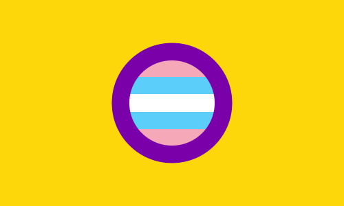
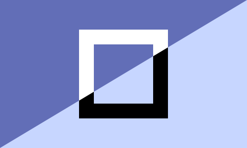

# drawpride

Drawing Pride Flags in Python using the drawsvg library.

See [examples.ipynb](https://github.com/intervexual/drawpride/blob/main/examples.ipynb) for examples of how to make flags. :)

## Basic drawing
Support for drawing as SVG and PNG:

Stripes:
* Horizontal lines
* Vertical lines
* Diagonal lines in the style of the Disability Pride Flag
* Reverse diagonal lines like in anarchist flags
* Seychelles-style lines
* Starburst-type patterns
* Concentric bézier curves in the style of the Mental Health Flag
* Concentric infinity symbols in the style of the Autistic Pride Day logo
* Concentric vees in the style of the varsex flag
* Concentric tees in the style of the tgirl/tboy flags
* Concentric rectangles in the style of the kymenic flags

Circular shapes:
* Standard Carpenter intersex flag ring
* Concentric rings
* Segmented rings
* Insetting a flag inside a Carpenter ring
* Solid circles
* Solid ellipses
* Concentric ellipses and circles
* Belt like in the Voidpunk flag

Triangular shapes:
* Piles (the triangle that goes on the left-hand side of the Demisexual flag)
* Nested piles (like in the Progress Pride flag)
* Asymmetric piles (like in the tricolour Polyamory flag)
* Inverted triangles like in the Pink Triangle flag
* Ally A (upside-down chevron)
* Inner triangles in the style of the Bissu flag
* The Therian symbol (triangle & circle)

Stars:
* Five-pointed stars
* The five-pointed star with two path lines used in the Outernaut, Varinaut, etc flags
* Stars of David (both standard and outline-only)
* The seven-pointed star used for Otherkin flags
* The Nonhuman Unity symbol
* The Southern Cross
* Stars of arbitrary numbers of points, both traced out and filled in

And other possible flag elements:
* Text (e.g. the original Polyamory flag)
* Crosses (like in the Ipsogender flag)
* X-crosses (like in the Crossdresser flag)
* Squares (like in the Dyadic and Endosex flags)
* Half-squares (cut along diagonal, useful for endosex/dyadic flags)
* The rectangular shape used for the Caed- flags (e.g. Caedsexual, Caedromantic)
* Rhombi (squares rotated 45 degrees, used in an Altersex flag)
* Diamonds (rhombi that are squished horizontally)
* Hearts (like in the Biromantic flag)
* The round shape on the side of the Peri- and Varioriented flags
* The Rubber Zigzag
* BDSM Triskelion
* Armpit Fetish stripe shape
* The Pocketgender Flag
* Closet symbols
* Perisex symbols
* Altersex symbols
* Autism spectrum nautilus symbols
* Métis lemniscates
* Equals symbols like in the alternate Androgyne flag
* The Bipolar Flag

## Examples of use
A Jupyter notebook of examples is available in this directory ([examples.ipynb](https://github.com/intervexual/drawpride/blob/main/examples.ipynb)).

Many of the same examples are also available in drawflags/examples.py for even more illustrative examples. Here are just two:
```
intersex_yellow = '#FDD70A'
intersex_purple = '#7A01AA'
trans_pink = '#F5A9B8'
trans_blue = '#5BCEFA'
trans_stripes = [trans_pink, trans_blue, 'white', trans_blue, trans_pink]

d = draw.Drawing(500, 300)
draw_inset_into_intersex(d, trans_stripes, intersex_yellow, intersex_purple, orientation=HORIZONTAL)
d.save_svg(outdir + 'intersextrans.svg')
```



```
d = draw.Drawing(500, 300)
draw_reverse_diagonal_stripes(d, ['#626eb7', '#c7d6ff'])
draw_square(d, 'black')
draw_diagonal_cut_square(d, 'white')
d.save_svg(outdir + 'endosex.svg')
```



### Typical parameters
The standard parameters of a given drawing function (e.g. draw_heart, draw_ellipse, draw_concentric_rectangles, etc) are:
- `d`: a mutable drawing object that is altered by the function
- colour is specified by either:
  - `colours': a list of hex strings
  - `primary_colour' and (optional) `secondary_colour' (both hex strings)
- and optional parameters:
  - `wid`: the width of the rectangular area in which things will be drawn into (defaults to 100% of the width of `d`'s canvas)
  - `hei`: the height of the rectangular area in which things will be drawn into (default: 100% of `d`'s canvas height)
  - `x_start`: the x-coordinate of the upper left corner of the rectangular area into which things will be drawn (default: 0)
  - `y_start`: the y-coordinate of the upper left corner of the rectangular area into which things will be drawn (default: 0)
  - `size_ratio`: a scaling factor that generally corresponds to the radius (or equivalent) of the object being drawn
  - `stretch_ratio`: a scaling factor that generally affects the convexity of the object being drawn. Not always used.
  - `thick_ratio`: a scaling factor that generally corresponds to the line thickness of the stroke width used to draw a given object (usually an outline of the object). Not always used.
  - `orientation`: a string which indicates the orientation of the object being drawn ('H' for horizontal, 'V' for vertical, 'D' for diagonal, 'R' for reverse diagonal). Not always used. Currently poorly supported.

Many functions return a number that corresponds to a dimension of the object that was drawn. For example, draw_horiz_bars returns
the height of the typical horizontal bar. This number can then be used by later function calls to scale other flag elements.


## TODOs
Orientation support
- Rethink the multipile to make the geometry easier
- Vees
- Chevrons
- Seychelles
- Concentric Beziers
- Tees
- Square cutting
- Nautilus (beyond vertical/horiz)

Colour
- get the colour palette of a flag ordered by volume of flag
- get the colour palette of a flag ordered alphabetically in the style of Wikimedia Commons' flag categorization

Double check
- positioning of the dots in the triskelion

Embedding other SVGs
- right now this does what drawsvg does, i.e. embeds the other SVG as an image. Not ideal and should not be used for uploads to Wikimedia Commons.